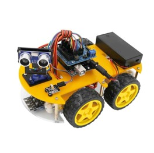

# Sonic Robot SmartCar

> This is a ReadMe template to help save you time and effort.
---

### Table of Contents
You're sections headers will be used to reference location of destination.

- [Description](#description)
- [Car Funcions](#Car-Functions)
- [The Car Parts](#The-Car-Parts)

---

## Description

Sonic is a Multifunction Robot Smart Car. 

### Car Funcions

1- Infrared Remote Control
2- Obstacle avoidance.
3- Line Tracking.
4- Bluetooth Control. 

[Back To The Top](#Sonic-Robot-SmartCar)

---

#### The Car Parts 
1. Battery compartment or 9v Power adapter: supply power for the vehicle
2. DC motor + wheels: drive the vehicle to move
3. Upper and under Acrylic Chassis: the frame of the car
4. L298N motor driving board: drive the motor to rotate
5. UNO R3 core board: the brain of the car, controls all the parts
6. IO expansion board: combined with the UNO, make connection become more easier
7. SG90 Micro Servo: enable the GP2Y0A21 distance sensor to rotate 180 degrees
8. Ultrasonic sensor module and holder: distance measurement and obstacle avoidance
9. Line tracking module: black and white sensor for recognition of the white and black lines
10. Infrared receiver and remote control: provide the Infrared remote-control function
11. Bluetooth module: provide the Bluetooth control function
12. LCD 1602 With IIC: Displaying what the robot doing.

[Back To The Top](#Sonic-Robot-SmartCar)
